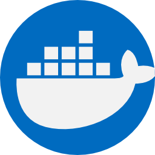
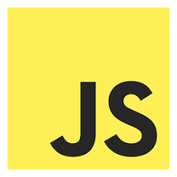

### :bulb: I’m a full-stack developer who is goal-oriented and highly productive.
### :rocket: Social and adaptable, I easily integrate into teams and can take the lead in organizing and guiding them when needed.
### :mag: I’m constantly growing, working on myself, and learning from my mistakes to become better every day.
---

  
  
  
  
  
  
  
  
  
  
  

---

  
  
  

